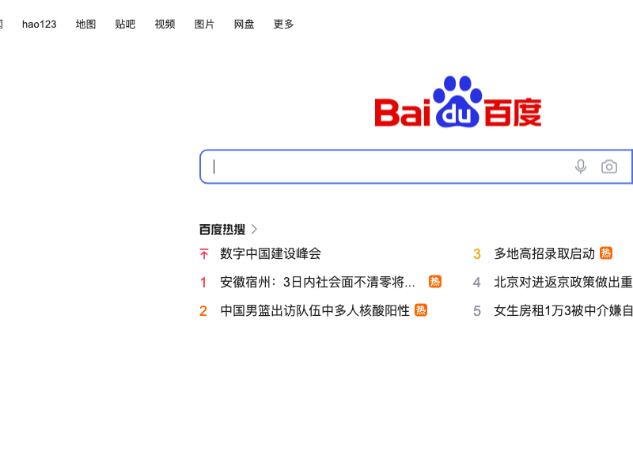

# Puppeteer

> Puppeteer 是一个运行在 Node 环境的 NPM 包，它提供了一个高级 API 来通过 DevTools 协议控制 Chromium 或 Chrome。Puppeteer 默认以无头浏览器模式运行，但是可以通过修改配置文件运行“有头”模式。

个人对 Puppeteer 的理解就是：暂时把它理解为一个运行在 Node 环境的 **无头浏览器**，我们可以通过[官方文档](https://zhaoqize.github.io/puppeteer-api-zh_CN/)提供的 API 来使用它做一些事情。可以做哪些事情呢？

- 生成页面 PDF。
- **抓取 SPA（单页应用）并生成预渲染内容（即“SSR”（服务器端渲染））**。这是我们关注的重点！！！
- 自动提交表单，进行 UI 测试，键盘输入等。
- 创建一个时时更新的自动化测试环境。 使用最新的 JavaScript 和浏览器功能直接在最新版本的Chrome中执行测试。
- 捕获网站的 timeline trace，用来帮助分析性能问题。
- 测试浏览器扩展。

## 学习目录

- [先跑个 Demo 看看](#demo)
- [预渲染原理](#预渲染原理)
- [预渲染的时机](#预渲染的时机)
- [在预渲染环境注入标识](#在预渲染环境注入标识)
- [结束语](#结束语)

## Demo

我们先通过一个简单的示例来了解 Puppeteer。下面是一个在命令行指定一个网址的 url，然后抓取页面的截屏。

```js
/**
 * file: src/screenshot.js
 */

// 引入 puppeteer
const puppeteer = require('puppeteer');
const { program } = require('commander');
const path = require('path');

// 设置一下命令行参数
program.option('-u, --url <url>', 'URL to screenshot');
program.parse();

(async () => {
    // 设置下载截屏图片的地址
    const downloadPath = path.join(__dirname, '../downloads/screenshot.png');
    // 解析参数中的 url
    const { url } = program.opts();
    // 创建一个浏览器实例
    const browser = await puppeteer.launch();
    // 创建一个新的页面实例
    const page = await browser.newPage();
    // 打开指定的 url
    await page.goto(url);
    // 截屏
    await page.screenshot({ path: downloadPath });
    // 关闭浏览器
    await browser.close();
})();
```

为了方便大家操作，我在 `package.json` 中配置了一个 `scripts` 字段，其中包含了一个 `screenshot` 命令，我们可以通过 `yarn  screenshot -u https://www.baidu.com/` 来执行这个命令。

```sh
$ yarn screenshot -u https://www.baidu.com/
```

然后就能在 `src/downloads` 目录下看到一个 `screenshot.png` 文件。



[代码地址](../puppeteer/src/screenshot.js)

## 预渲染原理

当我们的应用为单页面应用时，我们的 `index.html` 文件只有一个 js 入口文件。真正的 DOM 内容是需要页面资源加载完成之后，框架的 `Render 函数` 来渲染真实的 DOM 内容。

预渲染的原理在我们打包完毕之后，使用 Pupperteer 启动一个无头浏览器，然后用这个无头浏览器去访问我们想要缓存的页面路由，当页面资源加载完毕后，框架使用 `Render 函数` 渲染出真实的 DOM 内容。然后我们再通过开启的无头浏览器，来获取页面的完整 HTML 内容。

我们看下面的代码：

```js
// 引入 puppeteer
const puppeteer = require('puppeteer');
const { program } = require('commander');
const path = require('path');
const fs = require('fs');

// 定义命令行参数
program.option('-u, --url <url>', 'URL to screenshot');
// 解析命令行参数
program.parse();

(async () => {
    // 获取命令行参数
    const { url } = program.opts();
    // 创建浏览器
    const browser = await puppeteer.launch();
    // 创建页面
    const page = await browser.newPage();
    // 打开页面
    await page.goto(url);
    // 获取页面内容
    const content = await page.content();
    // 文件存储地址
    const filePath = path.resolve(__dirname, '../downloads', 'content.html');
    // 写入文件
    fs.writeFileSync(filePath, content);
    // 关闭浏览器
    await browser.close();
})();
```

这个时候我们打开看看 html 的[内容](../puppeteer/downloads/content.html)。

[代码地址](../puppeteer/src/pageContent.js.js)

看了上面两个例子，我们应该对 Puppeteer 有了一个大概的了解。这里再详细的解释一下 Puppeteer 到底是什么？其实 Puppeteer 只是一个 JSBridge 。我们通过调用 Puppeteer 的 API，来跟无头浏览器 或者 Chrome 内核来通信。也就是说 Puppeteer 是一个独立的 JS 库，只是我们 `yarn add puppeteer` 时，它的项目本身内会自带一个 Chrome 浏览器内核（Mac 下的目录地址：`node_modules/puppeteer/.local-chromium/mac-编码/chrome-mac/Chromium.app/Contents/MacOS/Chromium`）。因为它是一个独立的 JSBridge, 所以我们也可以通过参数 [option.executablePath](https://zhaoqize.github.io/puppeteer-api-zh_CN/#?product=Puppeteer&version=v15.3.1&show=api-puppeteerlaunchoptions) 给它指定一个 Chrome 浏览器（或者 Chrome 内核）的程序路径，来让它使用我们指定的浏览器做渲染。

我们知道了 Puppeteer 是什么，也知道了 Puppeteer 的大致用法。但还有一个问题需要解决：我们该什么时机使用 `page.content()` 去拿页面的内容，才能保证页面的 DOM 内容是完整的。带着这个问题，我们继续往下学习。

## 预渲染的时机

我们首先看一下 `page.content` 方法的介绍。

>  page.content()
> - returns: \<Promise\<string\>\>
> - 返回页面的完整 html 代码，包括 doctype。

从介绍上看，`page.content` 方法是仅用来获取预渲染的结果。也就是说，在 `page.content` 方法调用时，预渲染应该是处于完成状态才对。所以我们再去看看上一个步骤：`page.goto`。

关于 `page.goto` 的介绍：
> page.goto(url\[, options\])
> - url \<string\> 导航到的地址. 地址应该带有http协议, 比如 https://
> - options \<Object\> 导航配置，可选值:
>   - timeout \<number\> 跳转等待时间，单位是毫秒, 默认是30秒, 传 0 表示无限等待。可以通过page.setDefaultNavigationTimeout(timeout)方法修改默认值
>   - waitUntil \<string\|Array\<string\>\> 满足什么条件认为页面跳转完成，默认是 load 事件触发时。指定事件数组，那么所有事件触发后才认为是跳转完成。事件包括：
>     - load: 页面的load事件触发时
>     - domcontentloaded: 页面的DOMContentLoaded事件触发时
>     - networkidle0: 不再有网络连接时触发（至少500毫秒后）
>     - networkidle2: 只有2个网络连接时触发（至少500毫秒后）
>   - referer\<string\> 引用请求头。如果提供，它将优先于page.setExtraHTTPHeaders()设置的 referer 标头值。
> 
> 返回: \<Promise\<?Response\>\> Promise对象resolve后是主要的请求的响应。如果有多个跳转, resolve后是最后一次跳转的响应

我们重点看一下 `options.waitUntil` 参数。默认是 `load` 事件触发时，也就是页面加载完成(`window.onload`)后。

所以，当我们执行 `await page.goto('https://www.baidu.com/')` 时，`resolve` 的时机是 `window.onload` 之后。这就是我们调用 `page.content` 时能拿到完整 `html` 代码的原因。

但在我们的项目中，在 `window.onload` 的时机去做预渲染并不适合我们，因为我们需要加载的资源一般比较多，但首屏渲染，或者说我们的骨架屏并不需要全部的资源加载完。

所以我们去看看 `options.waitUntil` 的其他选项：

1. `domcontentloaded`: 同样不适合我们，因为我们单页面的应用只有一个入口文件，这导致 `domcontentloaded` 事件往往在浏览器渲染 DOM 内容之前触发。
2. `networkidle0`: **重点关注这个选项**，因为我们在预渲染中要使用这个选项。这个选项是说：“不再有网络连接时触发”。这是什么意思呢？我们的浏览器有一个请求队列，当我们发起请求时，浏览器会把这个请求添加到队列里。当请求完成后，浏览器会把这个请求从队列里移除。当队列的 length 为 0 的那一刻，浏览器就会触发 `networkidle0` 事件。哪怕在 1 毫秒之后，又有新的请求会进入队列。只要当下这一刻，请求队列的 length 为 0，就触发 `networkidle0` 事件。
3. `networkidle2`: 跟 `networkidle0` 类似，只不过 0 变成了 2 而已。

到目前为止，我们已经掌握预渲染的核心 API 了。但还有一个小问题，当我们的页面是在预渲染环境运行时，我们希望知道我们所运行的环境是预渲染环境，从而做一些事情。

做哪些事情呢？比如最常见的就是：不请求含有变化数据的接口（大部分接口都是这种情况）。为什么要这么做呢？假如说我们页面有一个获取当天日期的接口，那预渲染出来的结果就包含当天的日期。假如今天是 `2022年7月12日`。那当我们发布了我们的代码后，我们的页面就会显示成 `2022年7月12日`。就算今天已经不是 `2022年7月12日` 了，但在日期接口返回当天的日期前，就会一直显示为 `2022年7月12日`。

所以，在预渲染环境时，关于一些含有变化数据的接口，我们是不能请求的。想做到这一点，需要我们知道我们的代码运行的环境是否是预渲染环境。

## 在预渲染环境注入标识

> page.evaluateOnNewDocument(pageFunction\[, ...args\])
> - pageFunction \<function\|string\> 要在页面实例上下文中执行的方法
> - ...args \<...Serializable\> 要传给 pageFunction 的参数
> 
> 返回: \<Promise\>
>
> 指定的函数在所属的页面被创建并且所属页面的任意 script 执行之前被调用。常用于修改页面js环境，比如给 Math.random 设定种子

我们可以通过 `evaluateOnNewDocument` 方法来注入一个函数，这个函数会在页面被创建并且所属页面的任意 script 执行之前被调用。代码如下：

```js
page.evaluateOnNewDocument(function() {
    window.env = {
        isPrerender: true,
    };
});
```

这样我们就可以通过 `window.env.isPrerender` 来判断当前的环境是否是预渲染环境了。Demo 代码入下:

```html
<!DOCTYPE html>
<html>
<head>
    <meta charset="UTF-8" />
    <link rel="icon" href="/favicon.ico" />
    <meta name="viewport" content="width=device-width, initial-scale=1.0" />
    <title></title>
</head>
<body>
    <h1></h1>
</body>
</html>
<script>
    const h1Tag = document.querySelector('h1');
    h1Tag.innerText = window.env && window.env.isPrerender
        ? '当前是预渲染环境'
        : '当前是浏览器环境'
</script>
```

我将写两段脚本，一段脚本将在预渲染环境打开上面的 html 文件，另一段将在浏览器环境打开上面的 html 文件。

预渲染环境下访问 html 脚本如下：

```js
// 引入 puppeteer
const puppeteer = require('puppeteer');
const staticServer = require('./startServer');
// 启动一个静态服务器
const { url, close } = staticServer();

(async () => {
    // 为了方便用户查看，将打开一个非无头浏览器
    const browser = await puppeteer.launch({
        // 使用非无头模式
        headless: false,
    });
    // 启动一个页面
    const page = await browser.newPage();
    // 在页面钟注入环境变量脚本
    await page.evaluateOnNewDocument(function() {
        window.env = {
            isPrerender: true,
        };
    });
    // 访问静态服务器的地址
    await page.goto(url);
    // 等待 5 秒钟之后关闭页面
    await new Promise((done) => setTimeout(done, 5000));
    await browser.close();
    close();
})();
```

浏览器环境下访问 html 脚本如下：

```js
const childProcess = require('child_process');
const staticServer = require('./startServer');
// 启动一个静态服务器
const { url, close } = staticServer();
const openCommand = process.platform === 'darwin'
    ? 'open'
    : process.platform === 'win32'
        ? 'start'
        : 'xdg-open';

// 打开浏览器
childProcess.exec(`${openCommand} ${url}`);

setTimeout(() => {
    // 关闭静态服务器
    close();
    // 关闭子进程
    process.exit();
}, 5000);
```

为了方便测试，我在 `package.json` 的 scripts 中添加了两个命令。

```bash
# 为了方便用户查看，将打开一个非无头浏览器，访问上面的 html。5 秒钟后静态服务器和非无头浏览器关闭
$ yarn env:prerender

# 将打开一个浏览器，访问上面的 html。5 秒钟后静态服务器关闭
$ yarn env:browser
```

[代码地址](../puppeteer/src/prerenderEnv/)

## 结束语

到这里我们已经足够实现一个简版的预渲染了。如果你想继续学习，请阅读 [实现一个简版的预渲染](./prerender-mini.md)。
